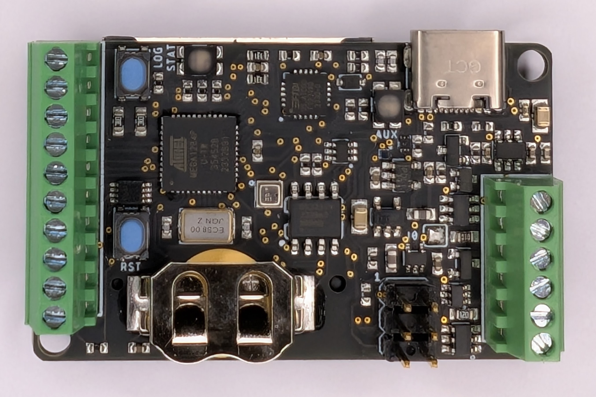
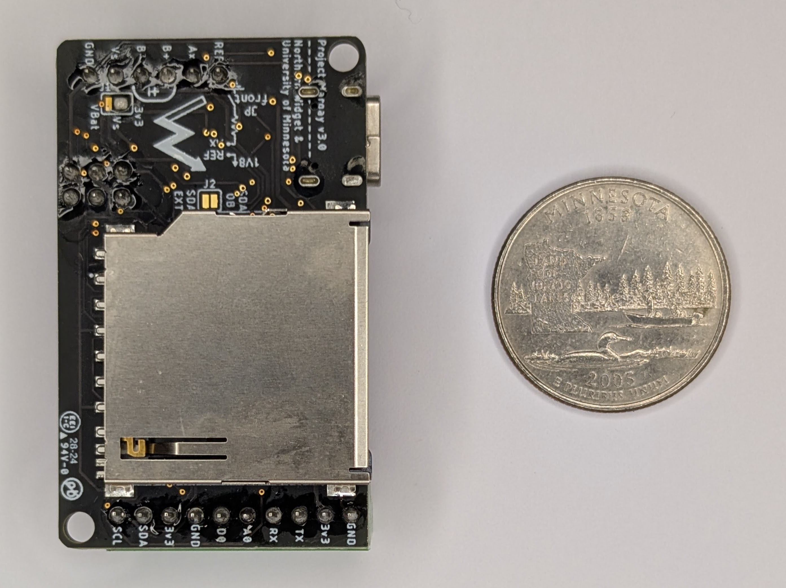

[](https://zenodo.org/badge/latestdoi/123350026)

# Project-Margay



***Margay data logger v3.0.*** *Top side showing ATmega1284p processor, USB-C connector, screw terminal I/O on both sides, and LOG/STAT/RST buttons.*

Project Margay is a micro scale environmental data logger designed based on the ALog series, it is designed to trade IO capabilities for cost and size, allowing for a very simple, but very useful data logger

## Namesake

Due to its small size and adaptability to its environment, Project Margay owes its name to the small Margay cat native to the forests of Central and South America.


***A yawning margay cat***

## Technical Specifications

### Electronic Hardware
This includes a description of the PCB and component functionality

#### Features:
* ATMega1284p Processor
* 3.3v Logic
* On board full size SD card (for ease of field use)
* Extremely low sleep current
* Input voltage designed for use with easy to find alkaline batteries
* 0.1" Pitch headers can be populated with header pins and placed on a breadboard for prototyping

### Current iteration:

#### v3.0



***Margay data logger v3.0, back side.*** *Full-size SD card for data storage. US quarter (24.3 mm diameter) shown for scale.*

Changes from v2.2:
* USB-C connector (replacing micro-USB)
* Increased mounting hole sizes to fit #4 screws
* Moved one passive component to accommodate the larger holes

All electrical specifications and pinout are otherwise identical to v2.2. Annotated pinout diagrams are in the [Pinout and board interfaces section below](#pinout-and-board-interfaces) and apply directly to v3.0.

### Past Iterations:

#### Features:
* ATMega644p Processor
* 3.3v Logic
* On board full size SD card (for ease of field use)
* Extremely low sleep current
* Input voltage designed for use with easy to find alkaline batteries
* 0.1" Pitch headers can be populated with header pins and placed on a breadboard for prototyping

#### v0.0 (Retired)
**Features** <br>
I<sub>Q</sub> = 1.6mA <br>
I<sub>out</sub> = 50mA, max (Regulated power supplied to sensors) <br>
V<sub>in</sub> = 3.3 ~ 5.5v <br>

**IO**:
* 1 I2C Bus
* 1 SPI Bus, with up to 2 CS pins
* 1 PWM Channel (output configurable to 3.3v or VBat via a jumper on bottom of board)
* RGB Status LED
* Auxiliary LED
* Reset Button
* Reconfigurable Button

#### v1.0
**Features** <br>
I<sub>Q</sub> = 2.5&mu;A <br>
I<sub>out</sub> = 50mA, max (Regulated power supplied to sensors) <br>
V<sub>in</sub> = 3.3 ~ 5.5v (Reverse polarity protected) <br>

**IO**
* 1 ADC, 18 bit
* 1 I<sup>2</sup>C Bus
* 1 SPI Bus, with up to 2 CS pins
* 1 PWM Channel (output configurable to 3.3v or VBat via a jumper on bottom of board)
* RGB Status LED
* Auxiliary LED
* Reset Button
* Reconfigurable Button

#### v2.0
**Features** <br>
I<sub>Q</sub> = <2.5&mu;A (Estimated) <br>
I<sub>out</sub> = 200mA, max (Regulated power supplied to sensors) <br>
V<sub>in</sub> = 3.3 ~ 5.5v (Reverse polarity protected) <br>

**IO**
* 1 ADC, 18 bit
* 1 I<sup>2</sup>C Bus
* 1 UART Channel
* 2 GPIO Pins (one configurable as an 8 bit ADC)
* 1 PWM Channel (output configurable to 3.3v or VBat via a jumper on bottom of board)
* RGB Status LED
* Auxiliary LED
* Reset Button
* Reconfigurable Button

#### v2.2
**Features** <br>
I<sub>Q</sub> = 1.68&mu;A <br>
I<sub>out</sub> = 200mA, max (Regulated power supplied to sensors) <br>
V<sub>in</sub> = 3.3 ~ 5.5v (Reverse polarity protected) <br>

**IO**
* 1 ADC, 18 bit
* 1 I<sup>2</sup>C Bus
* 1 UART Channel
* 2 GPIO Pins (one configurable as an 8 bit ADC)
* 1 PWM Channel (output configurable to 3.3v or VBat via a jumper on bottom of board)
* RGB Status LED
* Auxiliary LED
* Reset Button
* Reconfigurable Button

### Electronic Software and Firmware

* Programmable using the Arduino IDE https://www.arduino.cc/en/software
* Custom bootloader and board definition for ATMega1284p available via https://github.com/NorthernWidget/Arduino_Boards
* Custom libraries from Northern Widget and the open-source community
  * Primary data-logger functions
  * Libraries available with each sensor, exposing a standard interface
* Open-source licensing via GNU GPL 3.0

### Pinout and board interfaces
Pinout is listed on bottom of board. The pinout is identical across v2.2 and v3.0.


***Margay data logger with pins, connectors, and interactive items annotated, top side.***

**Pins are colored following this convention:**
* Ground: black
* Positive voltage: red
* Universal Serial Asynchronous Receiver--Transmitter (UART or USART) bus: blue
* Digital I/O: gray
* Analog measurement system: green
* I2C bus: purple

*The jumper on the front of the board, to the right of "B+" and "Ax", connects an on-board reference resistor (10 kOhm in our builds) with the analog pin Ax to create a voltage divider in which the sensor between Ax and REF is on the GND side of the voltage divider.*


***Margay data logger annotated, bottom side.*** This is where the labels for the above pins are printed.

In this pinout, the name of each pin is shown, as well as the group of pins which it belongs to, a detailed description of the pins and callouts follows:

#### Pins:
* 3v3, the switched 3.3v output rail, this rail can be turned on and off to disconnect power consumptive external devices
* GND, the main output ground
* BAT+, the positive connection for the battery line, voltage range 3.3v ~ 5.5v
* BAT-, Negative battery connection, ***note: this pin is NOT interchangeable with GND, as BAT- is reverse voltage protected to prevent damage from plugging the battery in backwards***
* Vs, this is the switched PWM output, the voltage of this output is determined by a solder jumper on the bottom of the board, controlled by `VSwitch_Pin` - See information of limits and configuration below

* MOSI, this is the master out, slave in, pin for the SPI bus, which doubles as **D5** when SPI and SD card are not used
* MISO, this is the master in, slave out, pin for the SPI bus, which doubles as **D6** when SPI and SD card are not used
* SCK, this is the clock line for the SPI bus, which doubles as **D7** when SPI and SD card are not used
* CS, this is the chip select pin for the SPI bus, which doubles as both **D11** and **INT1** when external SPI is not used (Can be used even when SD card is used)

* SCL, this is the dedicated serial clock line for the I2C bus
* SDA, this is the dedicated serial data line for the I2C bus

#### Callouts:
1. This is the auxiliary LED, which indicate TX and RX status using red and blue channels, green channel is controlled by `BuiltInLED` pin
2. This is the USB connection (USB-C on v3.0; micro-USB on v2.x), which can be used for both programming via the Arduino IDE and serial monitoring
3. This is the primary RGB status LED, where the individual channels are controlled by **D15**, **D14**, and **D13**
4. This is the reconfigurable push-button, generally used to initiate logging, it is read by `LogInt` pin
5. This is the hardware reset button, which will force the micro to return to the initial state after code upload
6. This is the ICSP header, which can be used to burn the bootloader to the board or write programs to the chip without using the USB and bootloader

#### Onboard Pins:
Pin Name | Pin Number (v0.0) | Pin Number (v1.0) | Pin Number (v2.x) | Function
-------- | ----------------- | ----------------- | ----------------- | --------
`SD_CS` | D4 | D4 | D4 | Chip select pin on SD card
`SD_CD` | D1 | D1 | D1 | Card detection pin for SD card, active low, AUX power must be on to use
`BuiltInLED` | D19 | D20 | D20 | Connected to green channel on **AUX** LED, on when pin is low
`RedLED` | D13 | D13 | D13 | Connected to red channel on **STAT** LED, on when pin is low
`GreenLED` | D15 | D15 | D15 | Connected to green channel on **STAT** LED, on when pin is low
`BlueLED` | D14 | D14 | D14 | Connected to blue channel on **STAT** LED, on when pin is low
`VRef_Pin` | A2 | A2 | A3 | Analog pin to read 1.8v on board reference, AUX power must be on to use
`ThermSensePin` | A1 | A1 | A1 | Analog pin to read thermistor voltage divider, AUX power must be on to use
`BatSensePin` | A0 | A0 | A2 | Analog pin to read battery voltage divider, AUX power must be on to use
`VSwitch_Pin` | D3 | D3 | D12 | Connected to MOSFET driver for **Vs** pin, active low
`Ext3v3Ctrl` | D12 | D19 | D22 | Turns on AUX power, active low
`I2C_SW` | N/A | D12 | D21 | Switches between on board I2C and external I2C
`PG` | D18 | D18 | D18 | Power good pin from core 3v3, can be used to test if core 3v3 is stable, pulled low when power is not stable
`ExtInt` | D11 | D11 | D11 | External interrupt and external chip select pin
`RTCInt` | D10 | D10 | D2 | Interrupt connected to RTC /INT line, active low
`LogInt` | D2 | D2 | A4 | Interrupt connected to **LOG** button, active low

#### VSwitch Power Limits/Configuration:
Jumper Selected | Logger Power Source | Current Limit, Avg [mA] | Power Limit, Avg [W] 
--------------- | ------------------- | ---------------------- | -------------------- 
VMain | USB | 220 | 0.5 
VMain | Bat | 500 | 2.25 
3v3 | USB | 220 | 0.5 
3v3 | Bat | 450 | 2.0

Note: Instantanious current may exceed these values - these values corespond to the time averaged power consumption. This disctinction is most important when driving a load via PWM. 

## On-board Devices

### I2C

| **Device**                                                	| **Default address** 	| **Reprogrammable address** 	| **Function**                                                     	|
|-----------------------------------------------------------	|---------------------	|----------------------------	|------------------------------------------------------------------	|
| [DS3231](https://github.com/NorthernWidget/DS3231_Logger) 	| 0x68                	| N                          	| Real-time clock                                                  	|
| [MCP3421](https://github.com/NorthernWidget/MCP3421)      	| 0x6A                	| N                          	| ADC                                                              	|
| [BME280](https://github.com/NorthernWidget/BME_Library)   	| 0x77                	| N                          	| On-board barometric pressure, temperature, and relative humidity 	|

### SPI

* SD Card

### UART (USART)

* FTDI USB-Serial converter

## Assembly

Assembling this data logger is possible by hand with sufficient skill and the following tools:
* Temperature-controlled soldering iron
* Hot-air rework station
* Equipment for stenciling with solder paste
* ESD-safe tweezers and workstation
* Solder wick

Mechanized assembly by a professional circuit-board assembly house, which is available in many parts of the world, may be preferred due to the complexity of this data logger board.

## Programming

### Downloading and installing the Arduino IDE

Go to https://www.arduino.cc/en/software. Choose the proper IDE version for your computer. For Windows, we suggest the non-app version to have more control over Arduino; this might change in the future. You will have to add custom libraries, so the web version will not work (at least, as of the time of writing). Download and install the Arduino IDE. Open it to begin the next steps.

For additional setup guidance, see the [Northern Widget tutorial](https://docs.northernwidget.com/tutorial/).

### Installing the Bootloader

Before a data logger can receive programs via the convenient USB port, it must have a *bootloader* that tells it to expect to receive new programs that way.  You can read more about bootloaders in general here: https://www.arduino.cc/en/Hacking/Bootloader.

Because you can't upload the bootloader via USB, you use the 2x3-pin 6-pin ICSP (also called ISP) header with a special device called an "in-circuit system programmer" (or just "in-system programmer; yup, that's what the acronym stands for).

Many devices exist to upload a bootloader including:
* The official [AVR ISP mkII](http://ww1.microchip.com/downloads/en/DeviceDoc/Atmel-42093-AVR-ISP-mkII_UserGuide.pdf) (no longer produced but available used)
* Using an [Arduino as an ISP](https://www.arduino.cc/en/tutorial/arduinoISP)
* The versatile [Olimex AVR-ISP-MK2](https://www.olimex.com/Products/AVR/Programmers/AVR-ISP-MK2/open-source-hardware)
* The [Adafruit USBtinyISP](https://www.adafruit.com/product/46)

***Important note for Linux users:*** You must supply permissions to the Arduino IDE for it to be able to use the ICSP, or you will have to run it using `sudo`. The former option is better; the latter is easier in the moment.

To upload the bootloader, do the following:

1. Open the Arduino IDE. If you have not yet installed the Northern Widget board definitions, find and install them here (instructions provided): https://github.com/NorthernWidget/Arduino_Boards - the Margay board should be run using the "TLog v1" board definition.
2. Select the desired board -- most likely ***ATMega1284p 8MHz*** under *Northern Widget Boards*.
3. Plug the data logger into your computer via USB (USB-C on v3.0; micro-USB on v2.x) to provide power.
4. Plug your ISP of choice into your computer (via a USB cable) and onto the 6-pin header. There are two ways to place it on; the header is aligned such that the ribbon cable should be facing away from the board while programming. If this fails without being able to upload, try flipping the header around.
5. Go to Tools --> Programmer and select the appropriate programmer based on what you are using.
6. Go to Tools --> Burn bootloader. Typically, within a few seconds, you learn whether you succeeded or failed. Hopefully it worked!

***Note: Be sure to download and/or update drivers for your ISP.***

### Hardware test sketch

The [`MargaySetup`](Software/MargaySetup/MargaySetup.ino) sketch in the `Software/` folder lets you verify every hardware subsystem over the serial monitor at 38400 baud. Commands are listed in the [Full hardware test command reference](#full-hardware-test-command-reference) table below. It also handles serial number programming (`SN Set` / `SN Read`).

Required libraries — install manually from GitHub (see [Arduino library installation guide](https://www.arduino.cc/en/Guide/Libraries), "Manual" method):
* [DS3231](https://github.com/NorthernWidget/DS3231) — real-time clock
* [MCP3421](https://github.com/NorthernWidget/MCP3421) — on-board ADC
* SD — SD card (bundled with the Arduino IDE)

### Data logging

For data logging, use the [Margay_Library](https://github.com/NorthernWidget/Margay_Library). It handles sleep, wake, SD writes, RTC, and on-board sensor reads automatically. Sample code is in the [Sample code](#sample-code) section below.

Install the library and its dependencies manually from GitHub:
* [Margay_Library](https://github.com/NorthernWidget/Margay_Library)
* [DS3231_Logger](https://github.com/NorthernWidget/DS3231_Logger)
* [NW_MCP3421](https://github.com/NorthernWidget/MCP3421)
* [BME](https://github.com/NorthernWidget/BME_Library)
* [SdFat](https://github.com/greiman/SdFat) — available via Arduino Library Manager

### Setting the serial number

If you need to set a serial number on your Margay board, upload [this sketch](https://github.com/NorthernWidget/Project-Margay/tree/master/Software/MargaySetup) available in the "Software" folder within this repository.

Once the above testing sketch has been uploaded

Type `SN Set`, followed by either a carriage return or a linefeed/newline character, to enter a prompt to set the serial number. This will give you three fields into which you can enter 4-digit hexadecimal (0-F) numbers:
* Board type; at Northern Widget, use `0x4D03` for the Margay v3.0, or `0x4D02` for v2.2 (full series: v0.0 = `0x4D00`, v1.0 = `0x4D01`). If you have built your own board, please do *not* use these numbers, as we would like to keep our series separate for the sake of recordkeeping
* Group ID: We use this to denote collaborative projects vs. internal use vs. general sales
* Unique ID: This is a monotonically increasing number.

If you wish to later read the serial number, type `SN Read`.

### Full hardware test command reference

The same sketch provides a serial command interface at **38400 baud** for testing all individual hardware subsystems. Send a command followed by a carriage return or newline. Continuous tests run until a carriage return is sent to stop them.

Command | Description
--------|------------
`SD` | Writes a random value and short string to the SD card, reads it back, reports PASS/FAIL
`Clock` | Sets the RTC to a known time, waits 5 seconds, reads it back, reports PASS/FAIL
`I2C` | Scans the I2C bus and prints the address of every device found
`ADC Disp` | Continuously prints voltages for the on-board reference, thermistor, battery, and external ADC (Ax)
`IO` | Toggles the VSwitch and ExtInt pins
`PG` | Reads the Power Good pin and reports PASS/FAIL
`Power` | Toggles the external 3.3V rail on and off
`Button` | Waits 2 seconds for the Log button to be pressed and reports if detected
`LED` | Cycles through each channel of the RGB and AUX LEDs
`SN Set` | Sets the serial number in EEPROM (see above)
`SN Read` | Reads back the serial number from EEPROM

### Using Custom Software (Developer)
As we provide all information about on board pins and their functionality, it is easy for a user to write their own code in the Arduino IDE to leverage the hardware capabilities of the Margay to whatever degree is desired. To do this, the Northern Widget board file can be used (as described above), or the **[MightyCore](https://github.com/MCUdude/MightyCore)** Board files can be used. These are the board files the Northern Widget ones were based on, but allow for more compilation options for the user. Full instructions for installation and use are provided on the MightyCore GitHub page.

For **v2.0 and later** (ATmega1284p), the recommended settings are:

Setting | Value
--------|------
`Board` | `ATmega1284`
`Pinout` | `Standard`
`Clock` | `8MHz External`
`Compiler LTO` | `Disabled`
`Variant` | `1284P`
`BOD` | `2.7v`

For **v0.0 and v1.0** (ATmega644p), the recommended settings are:

Setting | Value
--------|------
`Board` | `ATmega644`
`Pinout` | `Standard`
`Clock` | `8MHz External`
`Compiler LTO` | `Disabled`
`Variant` | `644P / 644PA`
`BOD` | `2.7v`

#### Sample code

`Margay_NoSensors.ino`

```c++
#include "Margay.h"
// Include any sensor libraries.
// The Northern Widget standard interface is demonstrated here.
//Sensor mySensor;

// Instantiate classes
// Sensor mySensor; (for any Northern Widget standard sensor library)
Margay Logger(MODEL_3v0);  // defaults to MODEL_3v0 if omitted; update for older hardware

// Empty header to start; will include sensor labels and information
String header;

// I2CVals for sensors
// Add these for any sensors that you attach
// These are used in the I2C device check (for the warning light)
// But at the time of writing, the logger should still work without this.
uint8_t I2CVals[] = {};

// Number of seconds between readings
// The Watchdog timer will automatically reset the logger after approximately 36 minutes.
// We recommend logging intervals of 30 minutes (1800 s) or less.
// Intervals that divide cleanly into hours are strongly preferable.
uint32_t updateRate = 60;

void setup(){
    // No sensors attached; header may remain empty.
    // header = header + mySensor.getHeader(); // + nextSensor.getHeader() + ...
    Logger.begin(I2CVals, sizeof(I2CVals), header);
}

void loop(){
    Logger.run(update, updateRate);
}

String update() {
    initialize();
    //return mySensor.getString(); // If a sensor were attached
    return ""; // Empty string for this example: no sensors attached
}

void initialize(){
    //mySensor.begin(); // For any Northern Widget sensor
                        // Other libraries may have different standards
}
```

### Reference

A full index of the public variables and functions within the Margay data logger library is available at https://github.com/NorthernWidget/Margay_Library.

## Field operator's guide

The [Margay Operations Guide (PDF)](Documentation/MargayGuide_20220622.pdf) covers field operation in printable form.

***Note: Logger will not be able to wake up unless the clock (RTC) is powered.***

The RTC (DS3231M) is powered exclusively by the **CR1220 coin cell** mounted on the back of the board. This is a separate power source from the main battery pack — the logger cannot wake from sleep if the coin cell is missing, dead, or making poor contact, even if the main batteries are fully charged.

**Cold-weather deployments:** Standard CR1220 cells (Li-MnO₂) are rated to −20°C and may fail at temperatures common in subarctic and arctic field sites. Observed clock failures in cold deployments are likely caused by the coin cell browning out at low temperature. For deployments below −20°C, replace the CR1220 with a [**Panasonic BR1220**](https://www.digikey.com/en/products/detail/panasonic-bsg/BR1220-BE/447510) (Li-CFx chemistry, rated −40°C to +125°C, drop-in replacement).

### Logging Start
Logging begins automatically once power is applied. If error conditions are found, they will be indicated by status lights, but the logger will attempt to continue if possible. The following should represent the light sequence.

- On power application
	- `AUX` light will illuminate **green**, will stay on while testing
- After testing is complete
	- `AUX` light will turn **off**
	- `STAT` light will illuminate with various colors depending on the status of the logger
    - See "Status Codes" under "Troubleshooting" below for details
	- `STAT` light will flash **long-short-short blue** to indicate logging has begun (older firmware: 5× long blue flash)

### Checking recorded data
1. After initializing, wait 2–3 minutes.
2. Follow the **SD card swap / Download** steps below to retrieve the SD card.
3. Verify that all data are recorded at the proper (UTC) time.
4. Verify that valid values are recorded for all sensors.
5. If files are not present, replace the SD card, check all connections, and re-initialize.

### SD card swap
1. Turn battery pack **off**.
2. Remove SD card. Label it and put it somewhere safe.
3. Insert a freshly labeled SD card.
4. Turn battery pack on and re-initialize.

### Downloading data
1. Turn battery pack **off**.
2. Remove SD card.
3. Insert SD card in computer.
4. Navigate to the most recent log file: `NW → <serial_number> → Log<number>.txt`
5. Save the file in a well-labeled and organized location.
6. Safely eject the SD card.
7. Re-initialize the logger.

### Troubleshooting
If an error code is received try the following steps:

**General**
* Disconnect and reconnect power, both USB and battery ([Turn it off and back on again](https://i.imgur.com/Yj6dB3W.gif))
* Verify the quality of all screw terminal connections by gently tugging on the wires and making sure they stay in place, if not, remove and re-tighten the connection
* Ensure sensors and/or cables are not damaged, this can result in shorts or other problems
* Make sure batteries have sufficient voltage to run the logger, when the battery voltage drops below *3.3v*, malfunctions can occur

#### Status Codes

The second LED (STAT) will have one of the colors below.

**Green**: All systems check out OK, logging will proceed

**Orange**: A sensor system is not registering properly, some sensor data may be missing or incorrect
* Verify correct polarity of sensor connection
* Ensure the right sensor is connected
* Verify the screw terminals are well connected to the wires (a loose connection can cause a failure)
* Make sure battery power is applied, some sensors can fail otherwise

**Cyan**: Clock time is incorrect, but logger is otherwise working correctly
* Connect the logger to a computer and reset the clock using the [Northern Widget Time Set GUI](https://github.com/NorthernWidget/SetTime_GUI)
* Note and record the wrong time if the logger has been out in the field, alongside the current (correct) time, to correct the prior measurements

**Pink**: (looks like purple to some people): SD card is not inserted
* Insert the SD card, or make sure card is fully seated

**Red**: Critical on-board component is not functioning correctly, such as SD card or clock; Logging will likely not be able to proceed
* Attempt power cycle
* Try different SD card
* Disconnect all sensors
* If none of the previous steps remove the red light, contact [Northern Widget](http://www.northernwidget.com/contact/) for further support

**Yellow, Fast Blinking**: <50% battery capacity
* Replace batteries

**Red, Fast Blinking**: Batteries <3.3V, voltage too low to properly function
* *If* this error occurs while also connected over USB, check proper connection of batteries
* Replace batteries

# Developer Notes

+ (**v0.0 / v1.0 only**) When using power from the external rail (the 3v3 on the screw terminals) it is always advised to have a battery connected to the board, even if connected via USB. The USB connection is able to power the core components, but not the external rail. This was resolved in v2.0.
+ (**v0.0 / v1.0 only**) When using I<sup>2</sup>C on the device, external pullups (4.7k&Omega; ~ 10k&Omega;) are required. If using devices strictly on-board, the internal pullups on the ATmega may be sufficient, but adding the capacitance of an external sensor cable often causes problems since the internal pullups are very weak. Dedicated switchable on-board pullups were added in v2.0.
+ (**All models**) The external power rails and the switched battery rail should be enabled in hardware by default, however, it is our recommendation to explicitly define these pins (`Ext3v3Ctrl`) as outputs and drive them `LOW` even if you never intend to switch them on and off. This prevents the rails from inadvertently being turned off due to a transient on the floating control line.

# Acknowledgments

Support for this project provided by:


<br/>
<br/>
<a rel="license" href="http://creativecommons.org/licenses/by-sa/4.0/"></a><br />Hardware and documentation are licensed under a <a rel="license" href="http://creativecommons.org/licenses/by-sa/4.0/">Creative Commons Attribution-ShareAlike 4.0 International License</a>. Software in the <code>Software/</code> directory is licensed under the <a href="https://www.gnu.org/licenses/gpl-3.0.en.html">GNU General Public License v3</a>.
